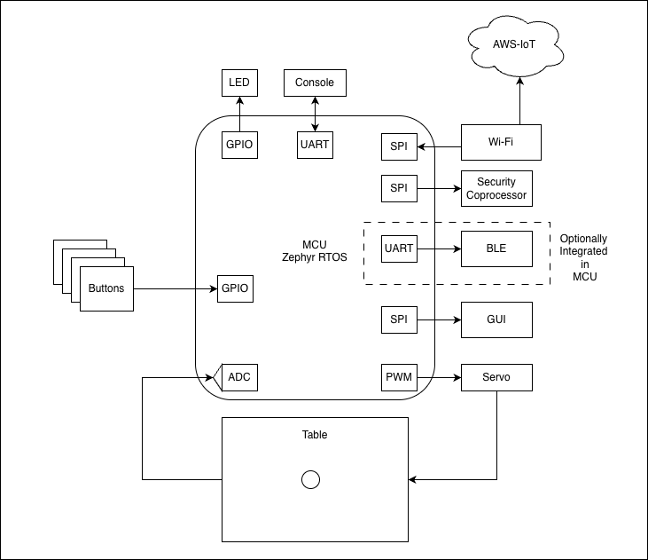

# equilibrio
A ball balancing project

# Goals:
This is a learning project focused on several learning goals:
* State Space control theory
    * I will start with a simple PID controller, but move to state space control
* Zephyr OS
    * Investigate the west build system 
    * Create a custom board within Zephyr
    * 
* Cloud Connectivity
    * send ball position and other meta data to the cloud
    * Change the balls balancing location from the cloud
    * AWS IoT for the first iteration

# Future goals:
In the future, the following technologies may be added for learning:
* BLE
* Display/graphics
* Capacitive Touch may be investigated as a sensor for ball position

# Block diagram:

# Firmware Architecture:

# Hardware needed:
* Electronics:
    * Adafruit Metro M4 board (later to be a custom board)
    * Custom shield with headers for servo motors, touchscreen sensor, and UART header for console I/O
    * CMSIS-DAP programmer - I'm using Atmel-ICE
    * 2 servo motors
    * 1 resistive touchscreen - from Amazon
* Custom balance table hardware
    * 3d-printed table hardware
    * Wooden base board to mount the table hardware

# Zephyr commands needed:
* Install the zephyr ecosystem for your OS following https://docs.zephyrproject.org/latest/develop/getting_started/index.html
* Build: need to be in the embedded_src directory
    > west build -b metro_m4 --pristine -- -DBOARD_ROOT=.
    - the -DBOARD_ROOT=. tells west to look for the custom board I created in the current directory (which has the boards subdirectory)
* Flash:
    > west flash

